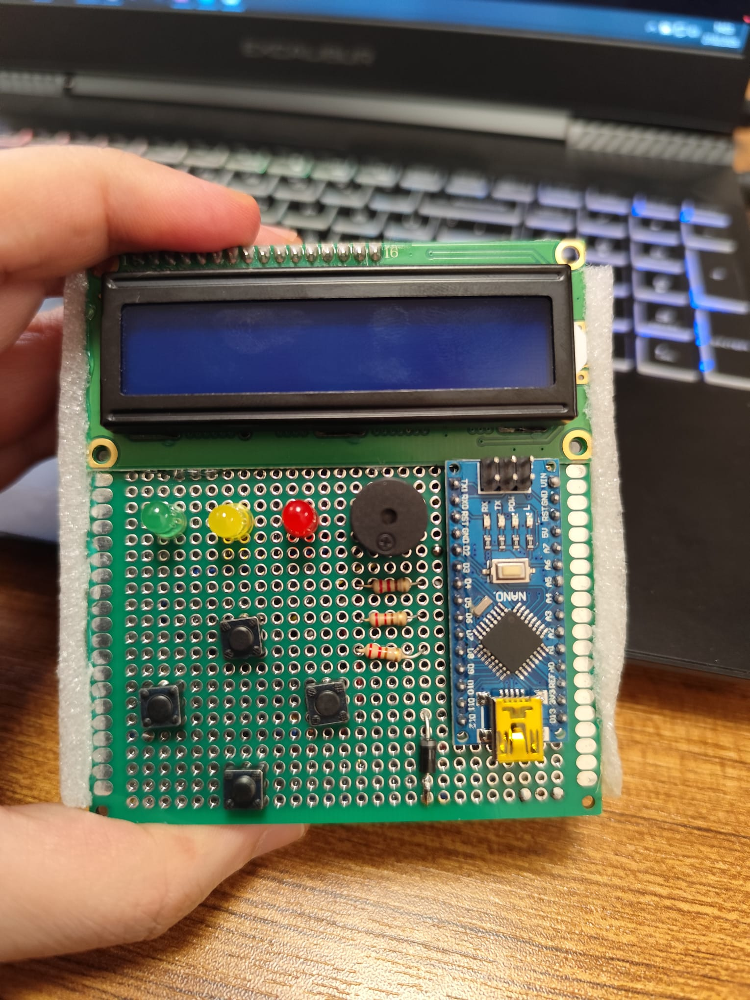
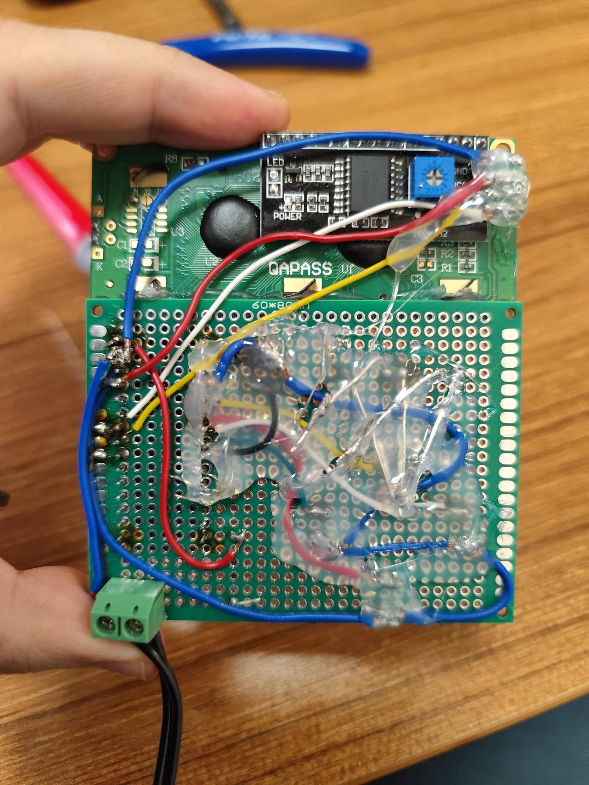
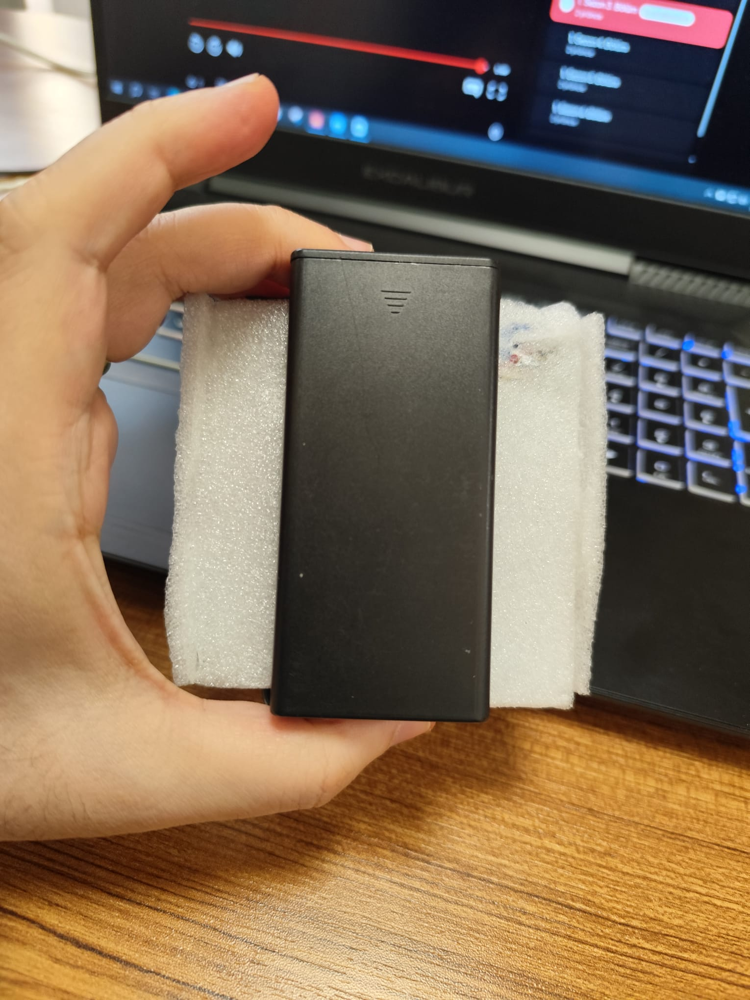

<div align="center">

```
██╗      ██████╗██████╗      ██████╗  █████╗ ███╗   ███╗███████╗
██║     ██╔════╝██╔══██╗    ██╔════╝ ██╔══██╗████╗ ████║██╔════╝
██║     ██║     ██║  ██║    ██║  ███╗███████║██╔████╔██║█████╗  
██║     ██║     ██║  ██║    ██║   ██║██╔══██║██║╚██╔╝██║██╔══╝  
███████╗╚██████╗██████╔╝    ╚██████╔╝██║  ██║██║ ╚═╝ ██║███████╗
╚══════╝ ╚═════╝╚═════╝      ╚═════╝ ╚═╝  ╚═╝╚═╝     ╚═╝╚══════╝
```

### 🕹️ A 5-game handheld console on an Arduino Nano + 16×2 LCD

[](https://opensource.org/licenses/MIT)


**Author:** Eren DOGAN &nbsp;|&nbsp;
[GitHub](https://github.com/erendogan83) &nbsp;|&nbsp;
[LinkedIn](https://www.linkedin.com/in/eren-dogan27/) &nbsp;|&nbsp;
[ORCID](https://orcid.org/0009-0009-0430-3395)

</div>

---

## 📸 Photos

| Front | Back | Battery |
|:---:|:---:|:---:|
|  |  |  |

---

## 🎮 The Games

```
┌─────────────────────────────────────────────────────────────────┐
│  #   GAME              GENRE          CONTROLS                  │
├─────────────────────────────────────────────────────────────────┤
│  1   Endless Runner    Dodge          FIRE = switch row         │
│  2   Snake             Arcade         UP/DN/LFT/FIRE = steer   │
│  3   Reaction Game     Reflex         FIRE on exact match       │
│  4   Whack-a-Mole      Speed          4 buttons = 4 holes       │
│  5   Memory Game       Simon Says     Watch, then repeat        │
└─────────────────────────────────────────────────────────────────┘
```

### 🏃 1 — Endless Runner
> *Dodge obstacles. Collect hearts. Don't die.*

- Press **FIRE** to toggle between the top and bottom row
- Two simultaneous obstacles (A & B) create back-to-back pressure
- Hearts spawn every 8 seconds for bonus points (+10)
- At score ≥ 100, obstacles may **flip their row mid-flight** — stay sharp
- Speed ramps from **220ms → 80ms** per tick over time
- 3 lives · EEPROM high score

```
┌────────────────┐
│ ♟   █       ♥ │  row 0  ← obstacle, heart
│     █   ♟  03 │  row 1  ← player (PCOL=2), score
└────────────────┘
    HUD: ♥♥♥ lives · 4-digit score (cols 12–15)
```

---

### 🐍 2 — Snake
> *Eat, grow, don't bite yourself.*

- **UP / DOWN / LEFT / FIRE** control direction — no 180° reversal
- Wrap-around walls — exit one side, enter the other
- **Turbo food** unlocks when length ≥ 12: catch it for +5 pts and a shrink
- Speed scales from **420ms → 120ms** per tick
- EEPROM high score

---

### 🎯 3 — Reaction Game
> *The marker bounces. The target blinks. Fire at the exact column.*

- A marker bounces left–right in row 1
- Targets blink in row 0 (cols 2–13)
- Hit = marker column matches target column exactly → **+10 pts**
- Miss = wrong column → **−1 life**
- **Combo system:** 3 hits → ×2 · 5 hits → ×3 multiplier
- Second target unlocks at score 30
- Marker speed: **300ms → 80ms** · Blink speed: **700ms → 200ms**
- 3 lives · 250ms hard debounce · EEPROM high score

```
┌────────────────┐
│    ●       ●   │  row 0  ← blinking targets
│ 030 x2  ►  ★  │  row 1  ← score, multiplier, marker, flash
└────────────────┘
```

---

### 🔨 4 — Whack-a-Mole
> *Four holes. Four buttons. Don't blink.*

- 4 holes mapped directly to 4 physical buttons:

```
   Physical layout          Screen layout
   ┌──────┬──────┐         ┌──────────────────┐
   │  UP  │ FIRE │         │ [U]          [R] │  row 0
   ├──────┼──────┤    →    │                  │
   │ LEFT │ DOWN │         │ [L]  [D]         │  row 1
   └──────┴──────┘         └──────────────────┘
         Hole positions: col { 1, 6, 6, 10 }
```

- Moles pop up for a limited window — shrinks with score
- Miss = mole escapes → **−1 life**
- Score ≥ 15: two moles can be active simultaneously
- Window: **2000ms → 650ms** · Spawn: **1600ms → 550ms**
- 3 lives · EEPROM high score

---

### 🧠 5 — Memory Game *(Simon Says)*
> *Watch the sequence. Then repeat it. Don't forget.*

- 4 symbols on screen, each mapped to a button:

```
  [L]<   [U]^   [D]v   [R]>
   col2   col6   col9  col13
   LEFT    UP   DOWN   FIRE
```

- Each symbol has a **unique tone** (C5 · E5 · G5 · C6)
- Wrong input or timeout (4s) = game over
- Sequence display speed increases every 3 rounds: **700ms → 250ms**
- Max sequence length: 16 steps
- EEPROM high score

---

## 🔧 Hardware

| Component | Details |
|---|---|
| Microcontroller | Arduino Nano (ATmega328P, 5V, 16MHz) |
| Display | 16×2 I2C LCD (HD44780 + PCF8574, address `0x27`) |
| Power | 2× 18650 Li-ion in series (8.4V) → Nano `VIN` |
| Buttons | 4× tactile push buttons |
| Buzzer | Passive buzzer |
| LEDs | Green, Yellow, Red with 220Ω resistors |
| PCB | 60×80mm perfboard with foam backing |

---

## 📌 Pin Layout

| Arduino Pin | Function |
|:---:|---|
| `A4` | LCD SDA |
| `A5` | LCD SCL |
| `D2` | Button UP |
| `D3` | Button DOWN |
| `D4` | Button LEFT |
| `D5` | Button FIRE |
| `D6` | Passive buzzer |
| `D7` | LED Green |
| `D8` | LED Yellow |
| `D9` | LED Red |
| `VIN` | 8.4V from 2× 18650 (series) |
| `GND` | Common ground |

---

## 🏆 EEPROM High Score Map

| Address | Game |
|:---:|---|
| `0–1` | Endless Runner |
| `2–3` | Snake |
| `4–7` | Reserved |
| `8–9` | Reaction Game |
| `10–11` | Whack-a-Mole |
| `12–13` | Memory Game |

All scores stored as **2-byte big-endian integers**. A corruption guard rejects values outside `0–9999`.

---

## ⚙️ Technical Design

### 🖥️ Double-Buffer Rendering
The game **never calls `lcd.clear()`** during gameplay. A `cur[2][16]` / `prv[2][16]` double-buffer tracks every character cell. On each frame, only changed cells are written to the LCD via `setCursor()` + `write()` — eliminating flicker and keeping I2C traffic minimal.

Custom sprites are encoded as `(char)(128 + slot)`. The flush function detects values ≥ 128 and calls `lcd.write(slot)` to render the correct CGRAM character.

### ⏱️ Non-Blocking Game Loop
All timing runs on `millis()` delta checks. `delay()` is never used inside gameplay — input polling stays responsive at all times.

### 🎛️ Button Debounce
Rising-edge detection with per-button lock timers (250ms). Each button has its own `prev` state and `lockUntil` timestamp — no shared state, no cross-button interference.

### 🗂️ Single-File Architecture
All 5 games live in one `game_console.ino`. A shared engine layer (buffer · buttons · LEDs · EEPROM) is defined once at the top. Each game is a self-contained function. Game-specific variables are declared locally — only the engine and a handful of Snake/Reaction Game helpers are global.

### 📊 Memory Usage

| Resource | Used | Available |
|:---:|:---:|:---:|
| Flash | ~26 KB | 32 KB |
| SRAM | ~700 B | 2 KB |

---

## 📦 Libraries

Install via **Arduino IDE Library Manager:**

```
LiquidCrystal_I2C  →  by Frank de Brabander
Wire               →  built-in
EEPROM             →  built-in
```

---

## 🚀 Build & Upload

```bash
# 1. Clone the repository
git clone https://github.com/erendogan83/arduino-lcd-game-console.git

# 2. Install CH341 driver (Arduino Nano clone users — required!)
#    Run CH341SER.EXE from the repo root and install the driver.
#    Without this, your PC will not recognize the Nano clone via USB.

# 3. Enable Serial Enumerator in Device Manager
#    Device Manager → Ports (COM & LPT) → USB-SERIAL CH340 (COMx)
#    → Right-click → Properties → Port Settings → Advanced
#    → Check "Serial Enumerator"  ← required for stable COM port detection

# 4. Open in Arduino IDE
#    File → Open → game_console / game_console.ino

# 5. Install LiquidCrystal_I2C via Library Manager

# 6. Board settings  ← these are mandatory, not optional
#    Board     : Arduino Nano
#    Processor : ATmega328P (Old Bootloader)

# 7. Select the correct COM port → Upload
```

> **⚠️ Clone Nano users:** Steps 2 and 3 are **mandatory**. Original Arduino Nanos use the FTDI chip and don't need the CH341 driver, but most affordable Nano clones use the CH340/CH341 chip. If your COM port disappears or upload fails, re-check the Serial Enumerator setting.

---

## 🗂️ Project Structure

```
arduino-lcd-game-console/
│
├── game_console/             # Main firmware (engine + all 5 games + menu)
│   └── game_console.ino
│
├── games/                    # Standalone versions of each game
│   ├── endless_runner.ino
│   ├── snake.ino
│   ├── reaction_game.ino
│   ├── whack_a_mole.ino
│   └── memory_game.ino
│
├── hardware_test/            # 6-stage hardware validation sketch
│   └── hardware_test.ino
│
├── photos/                   # Build photos
│   ├── front.jpg
│   ├── back.jpg
│   └── battery.jpg
│
├── CH341SER.EXE              # CH340/CH341 USB driver for Arduino Nano clones
└── README.md
```

---

## 📄 License

**MIT License** — free to use, modify, and share with attribution.

---

<div align="center">

*Built with stubbornness, solder, and 2KB of SRAM.*

</div>